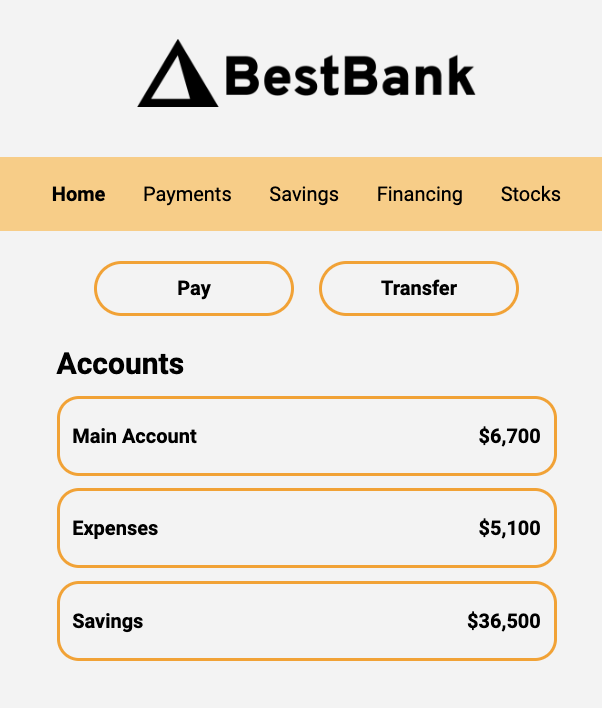

# Scrimba Bootcamp Solo Project

## Screenshot



## Project Requirements

Build the project from scratch and follow Scrimba's Figma design and use:

- Semantic HTML
- Hover
- Container
- Group Selectors
- Compound Selectors

## What I learned

1. Added `text-shadow` instead of `bold` in order to avoid any jitter when hovering on the nav titles:

```css
li:hover,
li:focus {
  text-decoration: underline;
  text-shadow: 0 0 0.01px var(--black);
}
```

2. I could not loop over the array unless I changed to class names. (I forgot I cannot use the id name more than once...)

3. Remember the Array.prototype.entries()
   The entries() method returns a new Array Iterator object that contains the key/value pairs for each index in the array.

```js
const a = ["a", "b", "c"];

for (const [index, element] of a.entries()) {
  console.log(index, element);
}

// 0 'a'
// 1 'b'
// 2 'c'
```

Reference: https://developer.mozilla.org/en-US/docs/Web/JavaScript/Reference/Global_Objects/Array/entries
